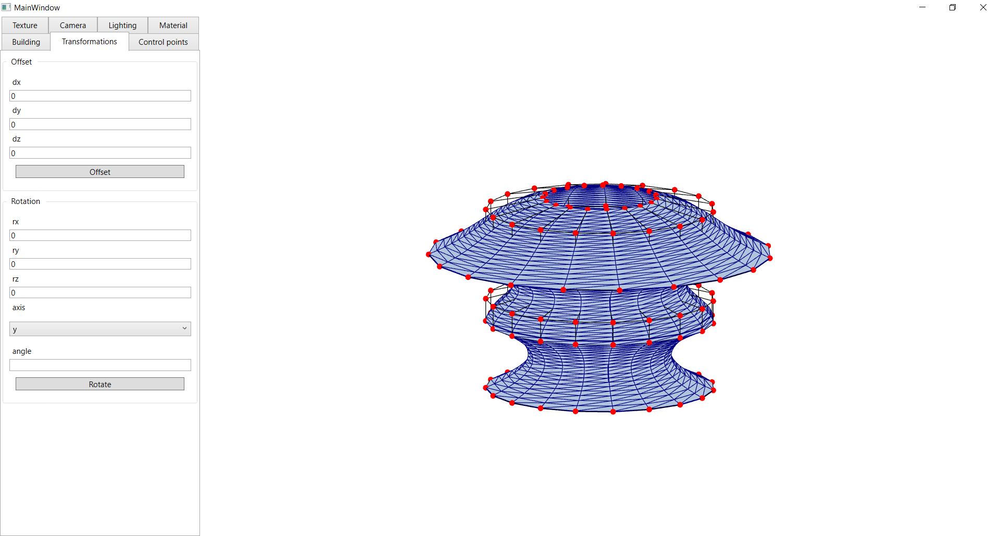
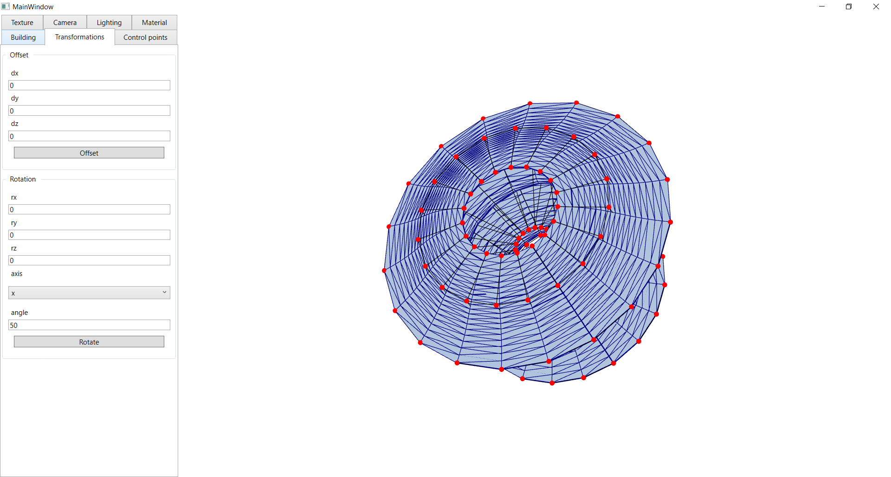
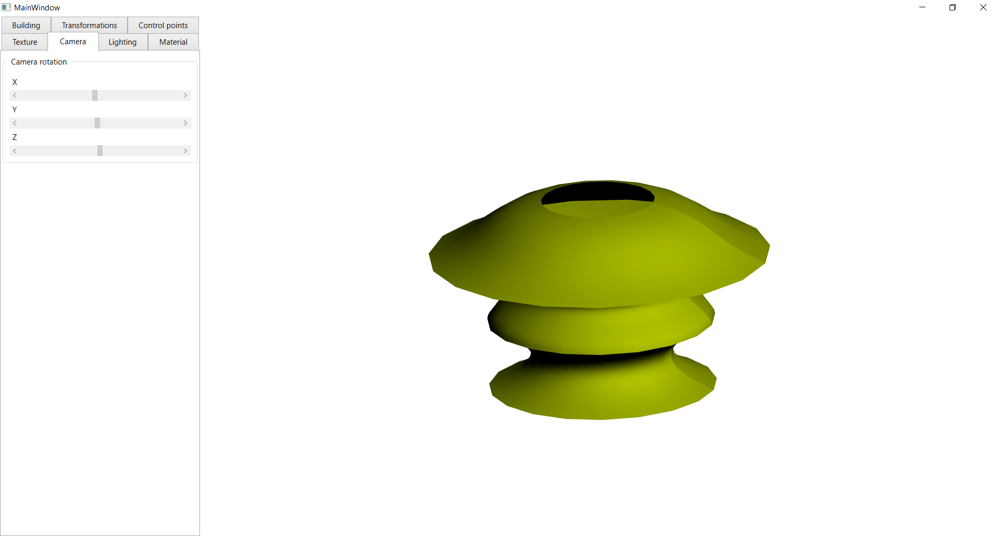
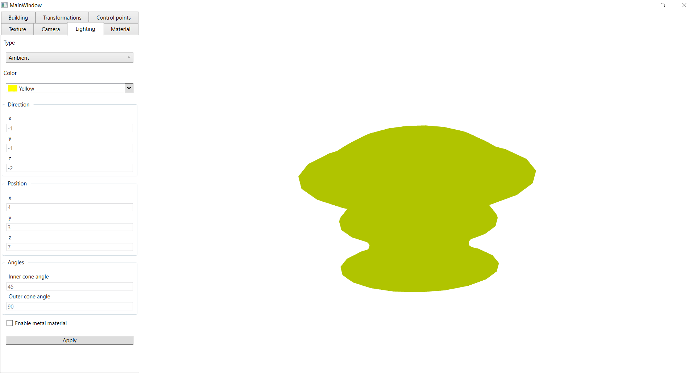
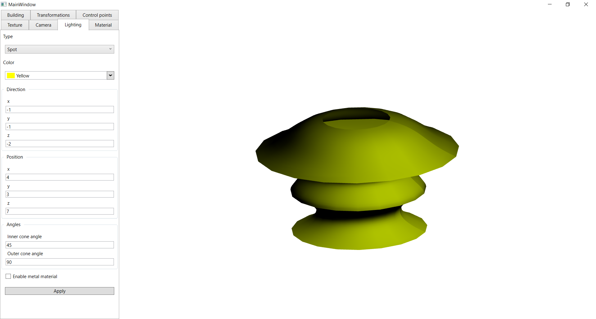

# Bezier Revolution
A system for displaying a three-dimensional surface. 

The following functions are implemented in the system: 
- The surface is displayed as a faceted body. 
- Performing Euclidean transformations of a three-dimensional body.
- Changing the number of faces.
- Calculation of the normal for the face and visualization.
- Ability to control the points of a rotating curve.

## Examples

Bezier revolution

Transformations

Directional lighting

Ambient lighting

Point lighting

Spot lighting
